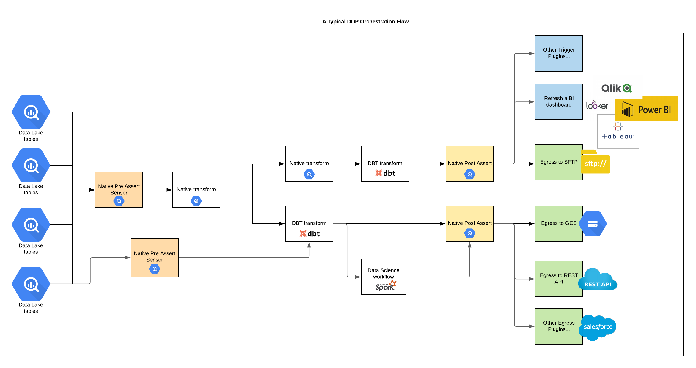
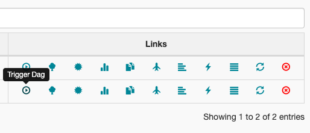
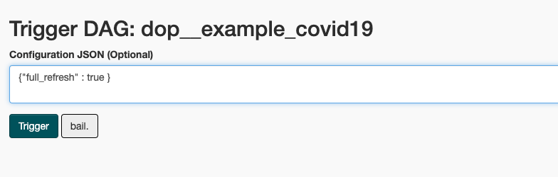
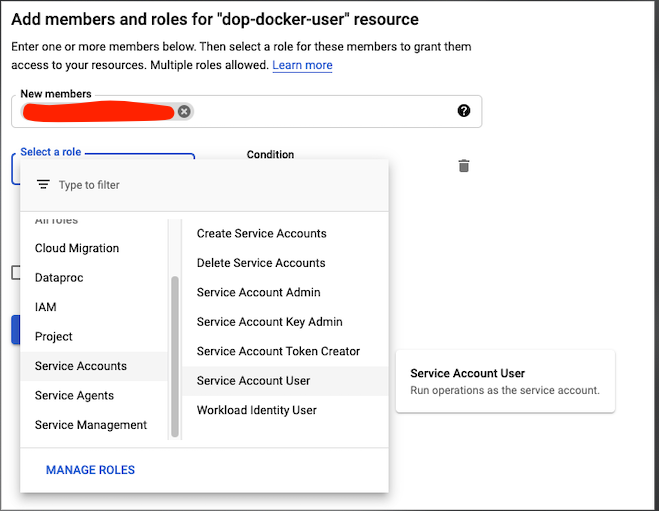
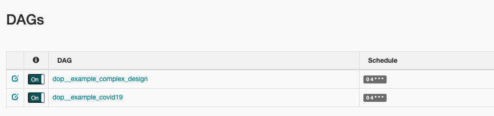
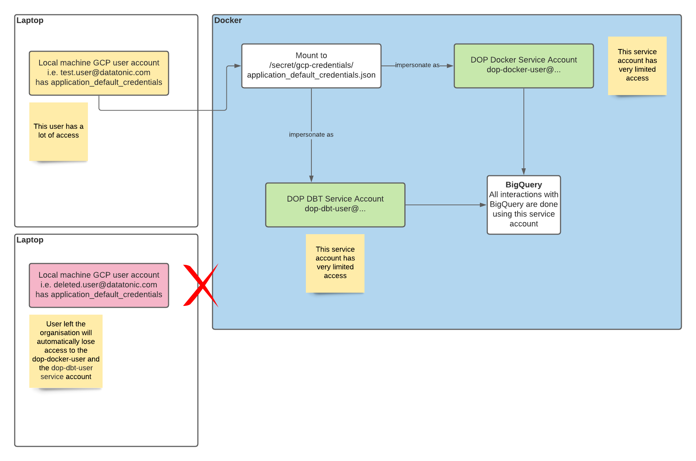

Table of contents
=================
* [What is DOP](#what-is-dop)
  * [Design Concept](#design-concept)
  * [A Typical DOP Orchestration Flow](#a-typical-dop-orchestration-flow)
  * [Native Transformations](#native-transformations)
     * [Materialization](#materialization)
     * [Invocation](#invocation)
     * [Assertion](#assertion)
  * [Third party integrations](#third-party-integrations)
* [Prerequisites - Run in Docker](#prerequisites---run-in-docker)
  * [For DOP Native Features](#for-dop-native-features)
  * [For DBT](#for-dbt)
* [Instructions for Setting things up](#instructions-for-setting-things-up)
  * [Run Airflow with DOP in Docker - Mac](#run-airflow-with-dop-in-docker---mac)
  * [Run Airflow with DOP in Docker - Windows](#run-airflow-with-dop-in-docker---windows)
  * [Run on Composer](#run-on-composer)
     * [Prerequisites](#prerequisites)
     * [Create Composer Cluster](#create-composer-cluster)
     * [Deployment](#deployment)
* [Misc](#misc)
  * [Service Account Impersonation](#service-account-impersonation)

# What is DOP
## Design Concept
DOP is designed to simplify the orchestration effort across many connected tasks through a simple YAML configuration file without the need to write any code.   

A Task can be a single operation of any kind, For example, a native transformation (i.e. running SQL on a storage engine such as BigQuery), a DBT job or any other kinds of tasks defined by a pre-configured adaptor.   

DOP utilises Apache Airflow's dependency management concept via a DAG (directed acyclic graph) with interactive visualisation capability.

Feature list
- Run native transformations (supporting only BigQuery at the moment)
- YAML, SQL and some knowledge of Airflow User Interface are the only skills required
- Third party components can be integrated such as orchestrating and running multiple DBT jobs
- (TODO) Additional features such as exporting data into GCS buckets, SFTP servers, triggering API calls (i.e. Looker API to reload a PDT or dashboard) or ingesting data from other systems are in the future development plan of DOP. 


## A Typical DOP Orchestration Flow


## Native Transformations
Supported Native transformations

### Materialization
This is a transformation type where a single SQL query can be executed for materialization.

Supports
- Table
- Stored Procedure (with dynamic arguments)
- View
- UDF (with dynamic arguments)
- Schema Creation (for BQ, this is creating a dataset)

Features
- Delta management using a date/timestamp partitioned column
- Automatic schema inference by query results with schema backwards compatibility checks and stops the execution when schema is backwards incompatible
- A full refresh can be triggered to do a full rebuild from sources

This is an example of a full refresh (overwriting existing schema & data), you can pass in a JSON payload using the trigger dag function in the Airflow UI





See how it works in the example DAG [here](examples/service_project/embedded_dop/orchestration/example_covid19)

### Invocation
This is a transformation type used to invoke things already existed such as an existing stored procedure. 

Supports
- Stored Procedure

See how it works in the example DAG [here](examples/service_project/embedded_dop/orchestration/example_covid19)

### Assertion
This is a transformation type used to perform data quality checks before triggering downstream transformations or just for sanity checks

Supports
- Assertion
- Assertion Sensor (TODO)

See how it works in the example DAG [here](examples/service_project/embedded_dop/orchestration/example_covid19)

## Third party integrations
- Data Build Tool ([DBT](https://www.getdbt.com/))

# Prerequisites - Run in Docker
Note that all the IAM related prerequisites will be available as a Terraform template soon!

## For DOP Native Features
1. Download and install Docker https://docs.docker.com/get-docker/ (if you are on Windows, please follow instruction here as there are some additional steps required for it to work https://docs.docker.com/docker-for-windows/install/)
1. Download and install Google Cloud Platform (GCP) SDK following instructions here https://cloud.google.com/sdk/docs/install.
1. Create a dedicated service account for docker with limited permissions for the `development` GCP project, the Docker instance is not designed to be connected to the production environment
    1. Call it `dop-docker-user@<your GCP project id>` and create it in `https://console.cloud.google.com/iam-admin/serviceaccounts?project=<your GCP project id>`
    1. Assign the `roles/bigquery.dataEditor` and `roles/bigquery.jobUser` role to the service account under `https://console.cloud.google.com/iam-admin/iam?project=<your GCP project id>`
1. Your GCP user / group will need to be given the `roles/iam.serviceAccountUser` and the `roles/iam.serviceAccountTokenCreator` role on the`development` project just for the `dop-docker-user` service account in order to enable [Service Account Impersonation](#service-account-impersonation).   

1. Authenticating with your GCP environment by typing in `gcloud auth application-default login` in your terminal and following instructions. Make sure you proceed to the stage where `application_default_credentials.json` is created on your machine (For windows users, make a note of the path, this will be required on a later stage)
1. Clone this repository to your machine, please note that all commands listed in the  `Instructions for Setting things up` section will need to be executed under the top level repository path of the cloned repository.

## For DBT
1. Setup a service account for your GCP project called `dop-dbt-user` in `https://console.cloud.google.com/iam-admin/serviceaccounts?project=<your GCP project id>`
1. Assign the `roles/bigquery.dataEditor` and `roles/bigquery.jobUser` role to the service account at project level under `https://console.cloud.google.com/iam-admin/iam?project=<your GCP project id>`
1. Your GCP user / group will need to be given the `roles/iam.serviceAccountUser` and the `roles/iam.serviceAccountTokenCreator` role on the `development` project just for the `dop-dbt-user` service account in order to enable [Service Account Impersonation](#service-account-impersonation).   

# Instructions for Setting things up

## Run Airflow with DOP in Docker - Mac

See [README in the service project setup](examples/service_project/README.md) and follow instructions.

Once it's setup, you should see example DOP DAGs such as `dop__example_covid19`


## Run Airflow with DOP in Docker - Windows
This is currently working in progress, however the instructions on what needs to be done is in the [Makefile](examples/service_project/Makefile)

## Run on Composer

### Prerequisites
1. Create a dedicate service account for Composer and call it `dop-composer-user` with following roles at project level
    - roles/bigquery.dataEditor
    - roles/bigquery.jobUser
    - roles/composer.worker
    - roles/compute.viewer
1. Create a dedicated service account for DBT with limited permissions. 
    1. [Already done in here if it’s DEV] Call it `dop-dbt-user@<GCP project id>` and create in `https://console.cloud.google.com/iam-admin/serviceaccounts?project=<your GCP project id>`
    1. [Already done in here if it’s DEV] Assign the `roles/bigquery.dataEditor` and `roles/bigquery.jobUser` role to the service account at project level under `https://console.cloud.google.com/iam-admin/iam?project=<your GCP project id>`
    1. The `dop-composer-user` will need to be given the `roles/iam.serviceAccountUser` and the `roles/iam.serviceAccountTokenCreator` role just for the `dop-dbt-user` service account in order to enable [Service Account Impersonation](#service-account-impersonation).
    
### Create Composer Cluster
1. Use the service account already created `dop-composer-user` instead of the default service account
1. Use the following environment variables
    ```
    DOP_PROJECT_ID : {REPLACE WITH THE GCP PROJECT ID WHERE DOP WILL PERSIST ALL DATA TO}
    DOP_LOCATION : {REPLACE WITH GCP REGION LOCATION WHRE DOP WILL PERSIST ALL DATA TO}
    DOP_SERVICE_PROJECT_PATH := {REPLACE WITH THE ABSOLUTE PATH OF THE Service Project, i.e. /home/airflow/gcs/dags/dop_{service project name}
    DOP_INFRA_PROJECT_ID := {REPLACE WITH THE GCP INFRASTRUCTURE PROJECT ID WHERE BUILD ARTIFACTS ARE STORED, i.e. a DBT docker image stored in GCR}
    ```
   and optionally 
   ```
   DOP_GCR_PULL_SECRET_NAME:= {This maybe needed if the project storing the gcr images are not he same as where Cloud Composer runs, however this might be a better alternative https://medium.com/google-cloud/using-single-docker-repository-with-multiple-gke-projects-1672689f780c}
   ```
1. Add the following Python Packages
```
dataclasses==0.7
```
1. Finally create a new node pool with the following k8 label
```
key: cloud.google.com/gke-nodepool
value: kubernetes-task-pool
```

### Deployment
See [Service Project README](examples/service_project/README.md#deploy-to-cloud-composer)

# Misc
## Service Account Impersonation
Impersonation is a GCP feature allows a user / service account to impersonate as another service account.   
This is a very useful feature and offers the following benefits
- When doing development locally, especially with automation involved (i.e using Docker), it is very risky to interact with GCP services by using your user account directly because it may have a lot of permissions. By impersonate as another service account with less permissions, it is a lot safer (least privilege)
- There is no credential needs to be downloaded, all permissions are linked to the user account. If an employee leaves the company, access to GCP will be revoked immediately because the impersonation process is no longer possible

The following diagram explains how we use Impersonation in DOP when it runs in Docker


And when running DBT jobs on production, we are also using this technique to use the composer service account to impersonate as the `dop-dbt-user` service account so that service account keys are not required. 

There are two very google articles explaining how impersonation works and why using it
- [Using ImpersonatedCredentials for Google Cloud APIs](https://medium.com/google-cloud/using-impersonatedcredentials-for-google-cloud-apis-14581ca990d8)
- [Stop Downloading Google Cloud Service Account Keys!](https://medium.com/@jryancanty/stop-downloading-google-cloud-service-account-keys-1811d44a97d9)