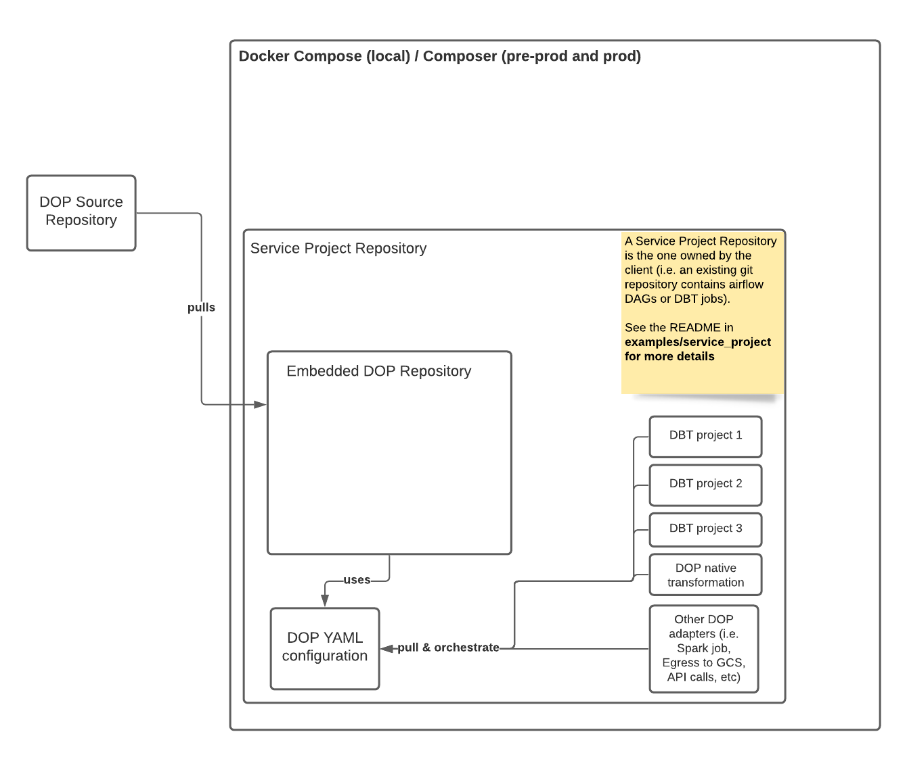

Table of contents
=================
* [DOP Service Project Architecture](#dop-service-project-architecture)
* [Boilerplate structure explained](#boilerplate-structure-explained)
   * [DBT Projects](#dbt-projects)
   * [The embedded_dop directory](#the-embedded_dop-directory)
      * [executor_config](#executor_config)
      * [orchestration](#orchestration)
      * [source](#source)
   * [The Makefile](#the-makefile)
* [Use DOP on Docker](#use-dop-on-docker)
* [Deploy to Cloud Composer](#deploy-to-cloud-composer)
   * [Build Artifact](#build-artifact)
   * [Deploy](#deploy)
      * [Important steps to follow for deploying to an existing Composer Cluster](#important-steps-to-follow-for-deploying-to-an-existing-composer-cluster)
* [DOP Orchestration - How To Use](#dop-orchestration---how-to-use)
   * [Create a new DOP Orchestration DAG](#create-a-new-dop-orchestration-dag)
   * [Task definitions](#task-definitions)
      * [Native Transformation - Materialization](#native-transformation---materialization)
      * [Native Transformation - Assertion](#native-transformation---assertion)
      * [Native Transformation - Invocation](#native-transformation---invocation)
      * [DBT Task](#dbt-task)
   * [Full Refresh](#full-refresh)

The `service_project` directory can be used as a boilerplate to setup DOP on an existing GIT repository (the service project repository).
You can copy and paste everything in this directory (including `.gcloudignore` and `.gitignore` as these are required for DOP to function correctly).
If you already have a `Makefile` or any other conflicting files, you may need to move things around by merging those files or moving i.e. the `Makefile` into `embedded_dop`

**Please note that this boilerplate is optimised for running DBT jobs inside DOP alongside native capabilities. If you don't use DBT, some automation may not work as expected.**

## DOP Service Project Architecture
This explains how DOP functions and how it can be integrated into your existing git repositories


## Boilerplate structure explained

### DBT Projects
Currently the setup is optimised to orchestrate and run DBT jobs on Google Cloud and this directory can be used as a template in your service project to quickly setup DOP with multiple DBT projects.

For this to work, the service project repository must contain one or multiple DBT projects, each of them in their own folder.
For example,
```
dbt_project_1/dbt_project.yaml
dbt_project_1/...

dbt_project_2/dbt_project.yaml
dbt_project_2/...
```

### The embedded_dop directory
There are three main folders within this directory.

#### executor_config
This folder contains files required to build docker containers to be used on Cloud Composer and invoked via the Airflow K8 Pod Operator.

For example,
- the `dbt/config.yaml` file contains instructions to tell the build process where to locate the DBT projects inside this repository
- `Pipfile` and `Pipfile.lock` are used to maintain and lock Python dependencies so what's installed inside the docker container is always the same after each build

Currently this is not used on the sandbox environment when running locally with Docker Compose, DBT is still installed on the fly using dynamically created Python Virtual environment but this may change in the future.

#### orchestration
This folder contains some example orchestration jobs and it shows how DOP can be used to orchestrate the flow between DBT jobs, native transformations and any executors added in the future.
It's probably a good idea to look through these examples which will give you a good idea on how to orchestrate workload in DOP.

#### source
This is a directory reserved to store the DOP code, you won't see it in this repository because it's ignored by version control but when the build process runs, the DOP source code will be checked out to here.

### The Makefile
The `Makefile` contains instructions to automate the whole initialization process for DOP including checking out the DOP repository as well as defining required variables.
For the Makefile to work, placeholders (as defined in `#{}`) must be replaced with real values in the Makefile or overwritten via make command arguments.

## Use DOP on Docker
You can now use DOP on your laptop (Linux / Mac only for now, Windows instructions is in the works) by following the instructions as below.

Running it for the first time (this builds the docker image from scratch and may take a while, you can check where it got to with `make logs`)
```
make build
```

Once it's up and running, you can access the UI on
```
http://localhost:8082
```

Bring down the docker environment
```
make down
```

Subsequent runs to bring up the docker environment
```
make up
```

And to get into the docker container itself (useful for debugging), run
```
make exec
```

## Deploy to Cloud Composer
There is a light weight semi-automated deployment process built using Cloud Build, to deploy to an existing Composer Cluster, follow instructions as below.

### Build Artifact
```
make build-artifact
```
This will produce an artifact id pointed to the most recent build.

By default this will build the artifact using the DOP `master` branch, if a different branch or tag is required, this can be overwritten by using `DOP_TAG_NAME`, i.e. `DOP_TAG_NAME=v0.1.0`.

```
make build-artifact DOP_TAG_NAME={}
```

It is **very important** to consider using a tag made on the DOP source repository for a Production deployment so that the DOP version won't accidentally change when making a service project deployment.


### Deploy
```
make deploy DEPLOY_BUCKET_NAME={} DOP_ARTIFACT_ID={}
```
`DEPLOY_BUCKET_NAME`: This is the bucket name for Cloud Composer i.e. `us-central1-dop-sandbox-us-xxxxxxxx-bucket`   
`DOP_ARTIFACT_ID`: Use the most recent artifact id produced by the `Build Artifact` step or any historical artifact ids to rollback

#### Important steps to follow for deploying to an existing Composer Cluster
If you are deploying DOP to an existing composer cluster which often already has other DAGs running,
it is important to set some exclusions in your existing deployment process.

A typical deployment to Cloud Composer involves doing a rsync to a GCS bucket, in order to make sure the DOP service project path is not removed in this process add the following exclusions in the rsync.
```
export SERVICE_PROJECT_NAME=dop_<service project repository name> && gsutil -m rsync -r -d -x "^$SERVICE_PROJECT_NAME" gs://<path to dags>/dags gs://$BUCKET_NAME/dags
```

## DOP Orchestration - How To Use
If you prefer to just give it a go without reading documentation, see the example DAG [embedded_dop/orchestration/example_covid19](embedded_dop/orchestration/example_covid19).
Try playing around by changing the `config.yaml` file and see changes reflected in the Airflow GUI on your local environment

### Create a new DOP Orchestration DAG
1. Create a new folder under [embedded_dop/orchestration](embedded_dop/orchestration), the folder name will be the name of the DAG, with a `dop__` prefix. i.e. `dop__<folder name>`.
1. Create a configuration file inside the new folder and call it `config.yaml`. The Airflow DAG is automatically generated by parsing the `config.yaml` file. The config file has the following structure
    ```
    enabled: <Enable or disable the DAG, once disabled, the DAG will no longer appear in the Airflow UI, valie values are: true|false>
    schedule_interval: <Valid CRON expression used for DAG schedule, i.e. "0 4 * * *" or null if no schedule is required>
    timezone: <Timezone for the schedule, i.e. "Europe/London">
    schema: <Default schema to be used to persist data, only applicable to native transformations i.e. "dop_sandbox_us">
    tasks: <Tasks to be orchestreated, see task definitions below>
    ```
### Task definitions
The following kinds of tasks are currently supported

#### Native Transformation - Materialization
This task kind is designed to persist structure or data. Supported options are
```
  - identifier: <task id>
    kind:
      action: materialization
      target: <schema, udf, table, view, stored_procedure>
    dependencies:
      <a list of one or more dependencies, defined by using task id>
```
Targets
- schema (for BQ, this is creating a dataset): create a schema
- udf (with dynamic arguments): create a UDF from a SQL script
- table: create a table by materializing the output from a SQL script
- view: create a view from a SQL script
- stored_procedure (with dynamic arguments): create a stored procedure from a SQL script

Features
- Delta management using a date/timestamp partitioned column
- Automatic schema inference by query results with schema backwards compatibility checks and stops the execution when schema is backwards incompatible
- A full refresh can be triggered to do a full rebuild from sources

For the Materialization task, `identifer` must match to a SQL file located in the `/sql` folder.
To see a live example on how to configure each task, go to [embedded_dop/orchestration/example_covid19/config.yaml](embedded_dop/orchestration/example_covid19/config.yaml).

#### Native Transformation - Assertion
This task kind can be used to check data quality. Supported options are
```
  - identifier: <task id>
    kind:
      action: assertion
      target: assertion
    dependencies:
      <a list of one or more dependencies, defined by using task id>
```
For the Assertion task, `identifer` must match to a SQL file located in the `/sql` folder and in the `SELECT` statement of the assertion SQL, it must return at least two columns as shown below,
```
SELECT
       <anything that can returna boolean>                             AS success,
       <a text string to explain what this assertion is for>           AS description
```
The Airflow task will fail if `success` is evaluated as `false`

To see a live example on how to configure each task, go to [embedded_dop/orchestration/example_covid19/config.yaml](embedded_dop/orchestration/example_covid19/config.yaml).

#### Native Transformation - Invocation
This task kind can be used to trigger something that has already been created, i.e. a stored procedure. Supported options are
```
  - identifier: <task id>
    kind:
      action: invocation
      target: stored_procedure
    dependencies:
      <a list of one or more dependencies, defined by using task id>
```
To see a live example on how to configure each task, go to [embedded_dop/orchestration/example_covid19/config.yaml](embedded_dop/orchestration/example_covid19/config.yaml).

#### DBT Task
This task kind can be used to trigger a DBT job. The DBT jobs runs in a Python Virtual Environment when executed locally but runs in containers on Cloud Composer.
You don't have to worry about this as a user because the user experience on this between the two environments are almost identical.
```
  - identifier: <task id>
    kind:
      action: dbt
      target: <test|run>
    options:
      project: <the project folder name of DBT in the service repository, for the example DAG this can be either `dbt_start` or `dbt_start_two`>
      version: <the DBT version at or above 0.19.1. Please note this maybe deprecated in newer versions so that only one DBT version needs to be maintained>
      arguments:
        - option: <a valid dbt argument, '-m', '-x', '--fail-fast', '--threads', '--exclude', '--full-refresh' are currently supported>
          value: <a value goes with the argument>
        - ... <multiple arguments can be used together>
    dependencies:
      <a list of one or more dependencies, defined by using task id>
```
Under `options` you may optionally specify arguments for a DBT job, this can be very useful for breaking down a very large DBT job into smaller chunks, making it easier to maintain.

Some of the ideas are
- Make use of [tags](https://docs.getdbt.com/reference/resource-configs/tags). For example, use tags to split DBT tasks into logical groups and run them in separate steps.
- Create a dedicated DAG for `full refresh` with tags so each DBT logically group can be refreshed separately to save cost as well as making refresh faster

Keep in mind try not to over engineer the solution, only try to split the DBT job if it makes sense to do so and solving a real issue (i.e. rebuilding the whole thing costs too much / takes too long or, without tags the job is unmaintainable and very hard to identify area of failures)

To see a live example on how to configure this, go to [embedded_dop/orchestration/example_covid19/config.yaml](embedded_dop/orchestration/example_covid19/config.yaml).

### Full Refresh
This is an example of a full refresh (overwriting existing schema & data), you can pass in a JSON payload using the trigger dag function in the Airflow GUI.

Please note that regardless of native transformations or DBT jobs (or any other task with full refresh support), using the `{"full_refresh" : true}` flag will force a full refresh on all applicable tasks.


